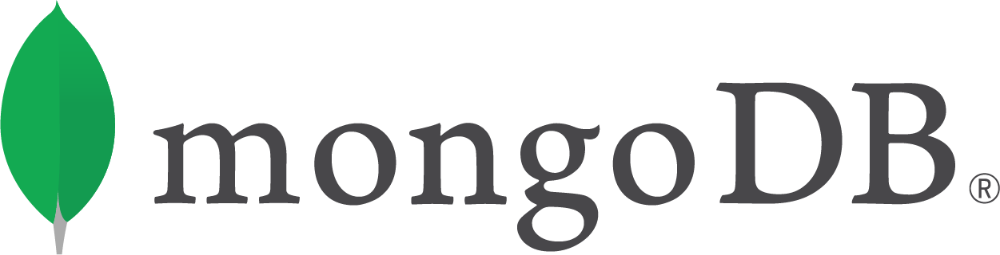

<!-- Optional: Your company logo, modify height as needed, remove if not wanted -->
<!-- If your logo file ends in jpg or jpeg, update the link below accordingly -->
   

# MongoDB
<!-- What does your company do? What makes you interesting? Why should a team use your tech? Enter text below: -->
MongoDB is the leading modern, general purpose database platform, designed to unleash the power of software and data for developers and the applications they build. MongoDB is a document database with the scalability and flexibility that you want with the querying and indexing that you need. With products like MongoDB Atlas & MongoDB Stitch you can spend more time building apps than managing databases.
# Challenge Info
<!-- What are you looking for? How will teams be judged? Enter text below:  -->
We're looking for the best and most innovative application of MongoDB, MongoDB Atlas and MongoDB Stitch. Teams will be judged by the tech they produce and the creativity of the application built.

# Prize Info
<!-- What is your sponsor prize? Is it one for each member? Enter text below: -->
TBD

# Getting Started
<!-- How do teams use your tech? Do you have links to resources? Are there directories here that include sample projects? Enter text below: -->
One of the core tenets of MongoDB is the ability to run anywhere.  This means you can run MongoDB in a wide variety of places: on your local machine, in your datacenter, in the cloud, and even on your mobile device!

## MongoDB Atlas (DBaaS available on Azure, AWS, or GCP)
The absolute easiest path to using MongoDB is to utilize **MongoDB Atlas** - our *Database-as-a-Service (DBaaS)* offering. We offer a truly free tier for **MongoDB Atlas** - and we don't even require a credit card.  Using **Atlas**, you can directly access MongoDB Atlas database from you web pages using Javascript - without the need for an intermediate Web Service or microservice by using our [QueryAnywhere](https://docs.mongodb.com/stitch/getting-started/configure-rules-based-access-to-mongodb/) Javascript SDK.  Using **MongoDB Atlass** also allows you to leverage [MongoDB Stitch](https://docs.mongodb.com/stitch/), our serverless, *Backend-as-a-Service*.

### MongoDB Atlas/Stitch Related Links
* [MongoDB Atlas](https://www.mongodb.com/cloud)
* [MongoDB Stitch Documentation/Tutorials](https://docs.mongodb.com/stitch/)
* [Getting Started with MongoDB Stitch - additional information](./stitch)
* [MongoDB Documentation](https://docs.mongodb.com/)
* [MongoDB Drivers](https://docs.mongodb.com/ecosystem/drivers/)
* [MongoDB Download page](https://www.mongodb.com/download-center/enterprise) - You may need to download the Full MongoDB product if you need access to backup/restore or import/export utilities.  If you only need the MongoDB Shell, you can [download the MongoDB Shell for Windows here](https://downloads.mongodb.org/win32/mongodb-shell-win32-x86_64-2008plus-ssl-4.0.8.zip).  For other operating systems, including Mac OSX and Linux, please refer to the *"Connect"* button in your Atlas cluster for download links.   
* [MongoDB Compass](https://www.mongodb.com/download-center/compass) - As the GUI for MongoDB, MongoDB Compass allows you to make smarter decisions about document structure, querying, indexing, document validation, and more. Compass is available as part of our subscriptions.  
MongoDB Compass is available in several versions, described below. For more information on version differences, see the [MongoDB Compass Documentation](https://docs.mongodb.com/compass/master/?_ga=2.167270397.237828379.1553986479-2088661027.1537206000).

## On Your Local Machine
If you choose to run MongoDB on your local machine, you will need to download and install MongoDB.  While this has historically been the most common method, there are several considrations when choosing this path:
* security policies on your laptop may prevent software from being installed
* firewalls on you local machine may block the port used my MongoDB (*default port is 27017*)
* hardware characteristics of your machine (*such as amount of RAM and available HD space*) may impose issues

### MongoDB (local) Related Links
* [MongoDB Download page](https://www.mongodb.com/download-center/enterprise)
* [MongoDB Documentation](https://docs.mongodb.com/)
* [MongoDB Drivers](https://docs.mongodb.com/ecosystem/drivers/)
* [MongoDB Compass](https://www.mongodb.com/download-center/compass) - As the GUI for MongoDB, MongoDB Compass allows you to make smarter decisions about document structure, querying, indexing, document validation, and more. Compass is available as part of our subscriptions.  
MongoDB Compass is available in several versions, described below. For more information on version differences, see the [MongoDB Compass Documentation](https://docs.mongodb.com/compass/master/?_ga=2.167270397.237828379.1553986479-2088661027.1537206000).

## MongoDB Mobile
MongoDB Mobile brings the power of MongoDB and the document model to your device. Same database, same access patterns – from IoT, iOS, and Android mobile devices to your backend.

### MongoDB Mobile Related Links
* [MongoDB Mobile](https://www.mongodb.com/products/mobile)

# Support
Slack Channel: [`#hw-mongodb`](https://americanairlines.slack.com/messages/CHR7FC93Q)
<!-- Other than asking for help from your team in our Slack workspace, how else can devs get help? Enter text below: -->

### Event Support
<!-- Add every member of your team here, provide as much detail as possible and use the format below -->
<!-- Leave each   where it is, they are used to make the formatting here nice! -->
Scott Stokes  
Slack: `@scott.stokes` 
email: scott.stokes@mongodb.com  
Cell: 214-277-4402 

Alex Monasterio  
slack: `@alex.monasterio`  
email: alex.monasterio@mongodb.com  
cell: 210-262-0762  

Britton LaRoche 
Slack: `@britton.laroche` 
email: britton.laroche@mongodb.com 
cell: 469-867-7881 

James Holt 
slack: `@james.holt` 
email: james.holt@mongodb.com 
Cell: 304-890-2837 

Megan Gino
slack: `@megan.gino` 
email: megan.gino@mongodb.com 
cell: 832-477-1698 

Kendrick Cummings 
slack: `@kendrick.cummings`  
email: kendrick.cummings@mongodb.com 
cell: 404-441-4450 

# More About Us
<!-- Optional: Anything else you want to say! Enter text below: -->
MongoDB was founded in 2007 by Dwight Merriman, Eliot Horowitz and Kevin Ryan – the team behind DoubleClick.

At the Internet advertising company DoubleClick (now owned by Google), the team developed and used many custom data stores to work around the shortcomings of existing databases. The business served 400,000 ads per second, but often struggled with both scalability and agility. Frustrated, the team was inspired to create a database that tackled the challenges it faced at DoubleClick.

MongoDB is the leading modern, general purpose database platform, designed to unleash the power of software and data for developers and the applications they build. Headquartered in New York, with offices across North America, Europe, and Asia-Pacific, we are close to where you do business. MongoDB has more than 13,000 customers in more than 100 countries. The MongoDB database platform has been downloaded over 60 million times and there have been more than 1 million MongoDB University registrations.

## Our Mission: To free the genius within everyone by making data ridiculously easy to work with

[https://www.mongodb.com/company](https://www.mongodb.com/company)
